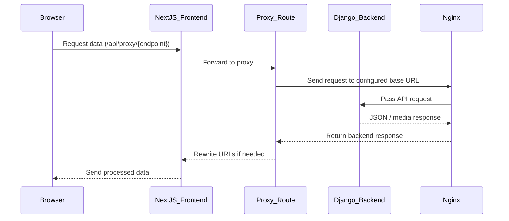

# Hoboc Project Documentation

## Overview

The Hoboc project is a full‑stack application composed of two main parts:

- **Frontend**: A Next.js application located in `frontend/`.
- **Backend**: A Django application located in `backend/`, backed by PostgreSQL for data storage and Nginx for serving static/media files and acting as a reverse proxy.

The backend runs as three core Docker services:

1. **nginx** – Handles static/media file serving and reverse proxying requests to Django.
2. **postgres** – The PostgreSQL database service.
3. **web** – The Django (backend) application service.

The application is containerized with Docker and uses `docker-compose.yml` in the project root to manage services for both frontend and backend.

---

## Table of Contents

1. [Overview](#overview)
2. [Nginx Configuration](#nginx-configuration)
3. [Frontend Creation](#frontend-creation)
4. [Environment Variables and .env Files](#environment-variables-and-env-files)
5. [How Frontend Gets Data from Backend](#how-frontend-gets-data-from-backend)
6. [Data Fetch and Post Utility Functions](#data-fetch-and-post-utility-functions)
7. [Frontend Development Notes](#frontend-development-notes)
8. [**Final All Services Deployment Notes**](#final-all-services-deployment-notes) 
9. [Data Flow Diagram](#data-flow-diagram)


## Nginx Configuration

The Nginx configuration file is located at:

```text
/backend/etc/nginx/nginx.conf
```

### Summary — Nginx in Backend Stack

Nginx acts as the **main reverse proxy** and **static file server** in the backend stack.

---

#### Upstreams

- **Django backend (`hoboc_web`)** — Runs on port `8000` inside Docker.  
  Requests to `/hoboc/` are proxied to this upstream for API endpoints.
- **Next.js frontend (`hoboc_frontend`)** — Runs on port `3000` inside Docker.  
  Requests to `/` (root path) are passed directly to the frontend server.

---

#### Key Features in Configuration

- **SSL Support**
  - Ports `80` and `443` with a self‑signed certificate for development.  
    _(Replace with production certificates in deployment)_.
- **Timeouts**
  - Client body, headers, send, read, and keep‑alive configured for stability.
- **API Proxy**
  - Proxies `/hoboc/` requests to Django backend (`hoboc_upstream`).
  - Preserves host headers, client IP, and supports **WebSocket upgrades**.
- **Static File Handling**
  - Serves files from `/opt/hoboc/static/` with long-term caching and **CORS** enabled.
- **Media File Handling**
  - Serves uploaded media from `/opt/hoboc/src/media/` with appropriate **CORS** headers.
  - Special handling for PDFs (`Content-Disposition: inline`) and **OPTIONS preflight** requests.
- **Frontend UI Proxy**
  - Routes `/` path requests to `frontend_upstream` (Next.js).
- **Error Page Routing**
  - Custom `50x.html` page for handling server-side 500‑series errors.

## Frontend Creation

The frontend was created following [this YouTube tutorial](https://www.youtube.com/watch?v=AnhKSBTWCWc).

**Initial Setup:**

```bash
npx create-next-app@14.1.0 djangobnb --typescript --eslint
cd djangobnb

npm uninstall @types/react-dom @types/react @types/node

npm install next@14.1.0 react@18 react-dom@18 \
  react-date-range@2.0.0-alpha.4 react-select@5.8.0 \
  react-use-websocket@4.8.1 socket.io@4.7.5 \
  socket.io-client@4.7.5 world-countries@5.0.0 zustand@4.5.0 \
  --save-exact

npm install @types/node@20 @types/react@18 @types/react-dom@18 \
  @types/react-date-range@1.4.9 autoprefixer@10.0.1 \
  postcss@8 tailwindcss@3.3.0 typescript@5 \
  --save-dev --save-exact
```

## Environment Variables and .env Files

### Backend

The backend environment variables are defined in:

```bash
./.env
# ./backend/etc/env-sample
```

### Frontend

Frontend environment variables are loaded from:

```bash
./frontend/src/.env
./frontend/src/env-sample
```

## How Frontend Gets Data from Backend

The data flow between the frontend and backend is handled in two main steps:

---

### Step 1 — Configuration

**File:** `frontend/src/app/services/config/config.ts`

- Reads environment variables from `.env` and makes them available throughout the application.
- Defines the following configuration values:
  - **API_BASE_URL** — Base URL for API requests.
  - **MEDIA_STATIC_BASE_URL** — Base URL for serving media and static files.
  - **API_TOKEN** — Token for authentication with the backend API.
  - **PUBLIC_SITE_FALLBACK** — Default site to use if the primary configuration is unavailable.

---

### Step 2 — Proxy Routes

**File:** `frontend/src/app/api/proxy/[...path]/route.ts`

- Acts as a proxy layer between Next.js and the Django backend.
- Responsibilities:
  1. Receives browser requests sent to `/api/proxy/...`.
  2. Determines if the request is for a JSON API endpoint or for media/static content.
  3. Forwards the request to the backend using `fetch()` with correct URLs and headers.
  4. Rewrites certain URLs in JSON responses so that the frontend can display them correctly.

## Data Fetch and Post Utility Functions

Located in:

```bash
frontend/src/app/services/receive_data/
```

### Data Fetch and Post Utility Functions — Details

These functions always hit the **frontend’s proxy API routes** (`/api/proxy/...`) instead of contacting the backend directly.

---

#### `fetchApiData.ts` — For Fetch Data Client Side

- Builds URL in the form `/api/proxy/{endpoint}/`.
- Optionally appends query parameters.
- Fetches fresh data using `cache: "no-store"` to avoid stale results.

---

#### `postApiData.ts` — For **POST** requests (JSON)

- Sends request body as JSON to `/api/proxy/{endpoint}/`.
- Parses backend errors and returns an { data, error } object.

---

#### `postApiDataWithFile.ts` — For **POST** requests with file uploads

- Sends `FormData` to `/api/proxy/{endpoint}/`.
- Relies on browser-supplied `Content-Type` when uploading files.

---

#### `apiServerFetch.ts` — For Fetch Data Server Side

- Cleans endpoints to add or remove trailing slashes as needed.
- Detects static/media requests and formats URLs accordingly.
- Builds the final proxy URL and fetches data from the backend.
- Returns structured objects containing `data` or `error` fields, along with localized error messages.

---

### Frontend Development Notes

- **Environment consistency** is critical:
  - **Production Docker** → Keep URLs pointing to internal service names (e.g., `http://nginx/...`).
  - **Local development** → Use `localhost` or a reachable IP that maps to backend ports.
- **Local development startup flow**:

1. From the project root, run:

```bash
docker compose build
docker compose up
```

This starts all backend and supporting services.

2. Open frontend/src/.env and change API URLs from `http://nginx/...` to `http://localhost/...`:

```bash
NEXT_PUBLIC_API_BASE_URL=http://localhost/hoboc/api/
NEXT_PUBLIC_MEDIA_STATIC_BASE_URL=http://localhost/hoboc/
```

3.  In the `frontend/src` directory:

```bash
npm i
npm run dev
```

This runs the Next.js development server connected to your locally running backend.

### Final All Services Deployment Notes

Follow these steps to deploy the project correctly:

#### 1. Clone the Project

```bash
git clone <your-repo-url>
cd <project-folder>
```


#### 2. Set Environment Variables
##### Configure the backend .env: 

```bash
nano .env

DEBUG=true
LOG_LEVEL=INFO
POSTGRES_ENGINE=django.db.backends.postgresql_psycopg2
POSTGRES_NAME=hoboc
POSTGRES_USER=
POSTGRES_PASSWORD=
POSTGRES_HOST=postgres
POSTGRES_PORT=5432

```
##### Configure the frontend .env

```
nano ./frontend/src/.env
```
We develop locally or on the server, and based on that we must set different environment variables for the frontend.

Locally, we have two options to run the frontend:

- `docker compose up` → runs frontend as a Docker service
- `npm run dev` inside `frontend/src/` → runs frontend in development mode directly

###### For Server Deployment with Docker Compose

```
nano ./frontend/src/.env

# Production domain with HTTPS
# NEXT_PUBLIC_API_BASE_URL=https://hoboc.ir/hoboc/api/
# NEXT_PUBLIC_MEDIA_STATIC_BASE_URL=https://hoboc.ir/hoboc/
# NEXT_PUBLIC_HEALTHCHECK_URL=https://hoboc.ir/hoboc/api/health/
# NEXT_PUBLIC_SITE_URL=https://hoboc.ir
# NEXT_PUBLIC_SITE_FALLBACK=https://hoboc.ir

# Production IP with HTTP (not recommended for final deployment)
# NEXT_PUBLIC_API_BASE_URL=http://185.204.168.255/hoboc/api/
# NEXT_PUBLIC_MEDIA_STATIC_BASE_URL=http://185.204.168.255/hoboc/
# NEXT_PUBLIC_HEALTHCHECK_URL=http://185.204.168.255/hoboc/api/health/
# NEXT_PUBLIC_SITE_URL=http://185.204.168.255
# NEXT_PUBLIC_SITE_FALLBACK=http://185.204.168.255

NEXT_PUBLIC_API_TOKEN=

```

###### For Local Development with Docker Compose

```
nano ./frontend/src/.env

NEXT_PUBLIC_API_BASE_URL=http://nginx/hoboc/api/
NEXT_PUBLIC_MEDIA_STATIC_BASE_URL=http://nginx/hoboc/
NEXT_PUBLIC_HEALTHCHECK_URL=https://localhost/hoboc/api/health/
NEXT_PUBLIC_SITE_URL=http://localhost:3000
NEXT_PUBLIC_SITE_FALLBACK=http://localhost:3000

NEXT_PUBLIC_API_TOKEN=

```

###### For Local Development with `npm run dev` (frontend/src/)
```
nano ./frontend/src/.env

# NEXT_PUBLIC_API_BASE_URL=http://localhost/hoboc/api/
# NEXT_PUBLIC_MEDIA_STATIC_BASE_URL=http://localhost/hoboc/
# NEXT_PUBLIC_HEALTHCHECK_URL=http://localhost/hoboc/api/health/
# NEXT_PUBLIC_SITE_URL=http://localhost:3000
# NEXT_PUBLIC_SITE_FALLBACK=http://localhost:3000

NEXT_PUBLIC_API_TOKEN=

```

#### 3 HTTPS or HTTP Configuration 

When deploying on the server, you must use HTTPS to ensure secure communication but when develop locally no need to do that. Follows these steps based on `local` or `server` Developement:

##### Step 1. Enable HTTPS on ArvanCloud

1. Go to ArvanCloud panel
2. Enable Let's Encrypt SSL certificate (CDN configurations)
3. Activate HTTPS for your domain (e.g., `https://hoboc.ir`)

##### Step 2. Update Django Settings

In your backend, open:

```bash
nano ./backend/src/core/settings.py
```
At the **end of the file**, make sure these lines are uncommented for deployment:
```python
# ---------------------------------------------------------------------
# Make HTTPS Instead Of HTTP For Deployment (ONLY FOR DEPLOYMENT)
# ---------------------------------------------------------------------
SECURE_PROXY_SSL_HEADER = ('HTTP_X_FORWARDED_PROTO', 'https')
SECURE_SSL_REDIRECT = True

```

This will:

- Redirect all requests to HTTPS
- Ensure Django treats requests as secure
- Generate secure URLs


And For **local development**:

- **Comment** out the above lines in `settings.py` so you can work with plain `http://localhost`

✅ **With this setup:**

- Local development works with HTTP (localhost / nginx)
- Deployment uses HTTPS automatically via ArvanCloud + Django settings


##### 4. Edit The Code Based On New Domain Or Ip

```bash
# Configure the backend (CORS_ALLOWED_ORIGINS and CSRF_TRUSTED_ORIGINS)
nano ./backend/src/core/setting.py

# Configure the frontend:
nano ./frontend/src/next.config.mjs

```
next.config.mjs

#### 5. Build and Start Docker Services

```bash
docker compose build
docker compose up -d
```

#### 6. Run Django Migrations

```bash
docker exec -it hoboc_web bash
python manage.py migrate
```

#### 7. Create Django Superuser

```bash
python manage.py createsuperuser
```

#### 8. Create Django Superuser

```bash
python manage.py createsuperuser
```


#### 9. Define Token In Admin Panel

Open the admin panel: `http://<your-server-ip>/hoboc/admin/`


#### 10. Update Frontend Token

Stop the containers

```bash
docker compose down
```

Update the token in the frontend .env:

```bash
nano ./frontend/src/.env
```

#### 11. Rebuild and Restart Services

```bash
docker compose up --build -d
```

## Data Flow Diagram


