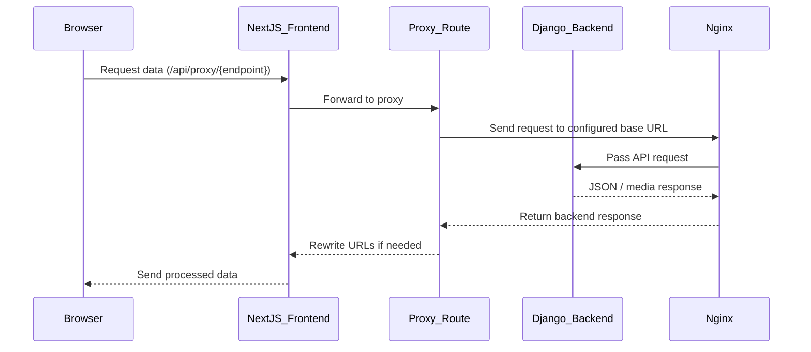

# Hoboc Project Documentation

## Overview

The Hoboc project is a full‑stack application composed of two main parts:

- **Frontend**: A Next.js application located in `frontend/`.
- **Backend**: A Django application located in `backend/`, backed by PostgreSQL for data storage and Nginx for serving static/media files and acting as a reverse proxy.

The backend runs as three core Docker services:

1. **nginx** – Handles static/media file serving and reverse proxying requests to Django.
2. **postgres** – The PostgreSQL database service.
3. **web** – The Django (backend) application service.

The application is containerized with Docker and uses `docker-compose.yml` in the project root to manage services for both frontend and backend.

---

## Table of Contents

1. [Overview](#overview)  
2. [Nginx Configuration](#nginx-configuration)  
3. [Frontend Creation](#frontend-creation)  
4. [Environment Variables and .env Files](#environment-variables-and-env-files)  
5. [How Frontend Gets Data from Backend](#how-frontend-gets-data-from-backend)  
6. [Data Fetch and Post Utility Functions](#data-fetch-and-post-utility-functions)  
7. [Frontend Development Notes](#frontend-development-notes)  
8. [Final All Services Deployment Notes](#final-all-services-deployment-notes)   
9. [Data Flow Diagram](#data-flow-diagram)


## Nginx Configuration

The Nginx configuration file is located at:

```text
/backend/etc/nginx/nginx.conf
```

### Summary — Nginx in Backend Stack

Nginx acts as the **main reverse proxy** and **static file server** in the backend stack.

---

#### Upstreams

- **Django backend (`hoboc_web`)** — Runs on port `8000` inside Docker.  
  Requests to `/hoboc/` are proxied to this upstream for API endpoints.
- **Next.js frontend (`hoboc_frontend`)** — Runs on port `3000` inside Docker.  
  Requests to `/` (root path) are passed directly to the frontend server.

---

#### Key Features in Configuration

- **SSL Support**
  - Ports `80` and `443` with a self‑signed certificate for development.  
    _(Replace with production certificates in deployment)_.
- **Timeouts**
  - Client body, headers, send, read, and keep‑alive configured for stability.
- **API Proxy**
  - Proxies `/hoboc/` requests to Django backend (`backend_web_upstream`).
  - Preserves host headers, client IP, and supports **WebSocket upgrades**.
- **Static File Handling**
  - Serves files from `/opt/hoboc/static/` with long-term caching and **CORS** enabled.
- **Media File Handling**
  - Serves uploaded media from `/opt/hoboc/src/media/` with appropriate **CORS** headers.
  - Special handling for PDFs (`Content-Disposition: inline`) and **OPTIONS preflight** requests.
- **Frontend UI Proxy**
  - Routes `/` path requests to `frontend_upstream` (Next.js).
- **Error Page Routing**
  - Custom `50x.html` page for handling server-side 500‑series errors.

## Frontend Creation

The frontend was created following [this YouTube tutorial](https://www.youtube.com/watch?v=AnhKSBTWCWc).

**Initial Setup:**

```bash
npx create-next-app@14.1.0 djangobnb --typescript --eslint
cd djangobnb

npm uninstall @types/react-dom @types/react @types/node

npm install next@14.1.0 react@18 react-dom@18 \
  react-date-range@2.0.0-alpha.4 react-select@5.8.0 \
  react-use-websocket@4.8.1 socket.io@4.7.5 \
  socket.io-client@4.7.5 world-countries@5.0.0 zustand@4.5.0 \
  --save-exact

npm install @types/node@20 @types/react@18 @types/react-dom@18 \
  @types/react-date-range@1.4.9 autoprefixer@10.0.1 \
  postcss@8 tailwindcss@3.3.0 typescript@5 \
  --save-dev --save-exact
```

## Environment Variables and .env Files

### Backend

The backend environment variables are defined in:

```bash
# ./backend/etc/env-sample
./.env
```

### Frontend

Frontend environment variables are loaded from:

```bash
# ./frontend/src/env-sample
./frontend/src/.env
```

## How Frontend Gets Data from Backend

The data flow between the frontend and backend is handled in two main steps:

---

### Step 1 — Configuration

**File:** `frontend/src/app/services/config/config.ts`

- Reads environment variables from `.env` and makes them available throughout the application.
- Defines the following configuration values:
  - **API_BASE_URL** — Base URL for API requests.
  - **MEDIA_STATIC_BASE_URL** — Base URL for serving media and static files.
  - **API_TOKEN** — Token for authentication with the backend API.
  - **PUBLIC_SITE_FALLBACK** — Default site to use if the primary configuration is unavailable.
  - **HEALTHCHECK_URL** — Base URL to ckeck the helth of backend using `health` api.


---

### Step 2 — Proxy Routes

**File:** `frontend/src/app/api/proxy/[...path]/route.ts`

- Acts as a proxy layer between Next.js and the Django backend.
- Responsibilities:
  1. Receives browser requests sent to `/api/proxy/...`.
  2. Determines if the request is for a JSON API endpoint or for media/static content.
  3. Forwards the request to the backend using `fetch()` with correct URLs and headers.
  4. Rewrites certain URLs in JSON responses so that the frontend can display them correctly.

## Data Fetch and Post Utility Functions

Located in:

```bash
frontend/src/app/services/receive_data/
```

### Data Fetch and Post Utility Functions — Details

All these functions route requests through the **frontend proxy API** (`/api/proxy/...`)  
to avoid direct backend calls, ensuring consistent CORS policy, authentication, and error handling.

---

#### `apiClientAxios.ts` — Client‑Side Data Fetch

- **Scope:** Runs in the browser (`window` is defined).
- Builds URL in form `/api/proxy/{endpoint}/` using `window.location.origin`.
- Can append optional query parameters.
- Always fetches **fresh data** (`cache: "no-store"`) to prevent stale responses.
- For SEO‑irrelevant or dynamic user interactions (filters, live updates).

---

#### `apiServerFetch.ts` — Server‑Side Data Fetch

- **Scope:** Runs during SSR (`getServerSideProps`, server actions) or inside API routes.
- Cleans endpoint paths:
  - Removes extra leading/trailing slashes.
  - Detects static/media files and formats accordingly.
- Assembles final URL: `${baseUrl}/api/proxy/{cleanedEndpoint}`.
- Returns unified structured objects with `{ data, error }`.
- Includes localized “no data” fallback messages for Persian UI.
- Recommended for **SEO‑critical** data so HTML ships with content.

---

#### `apiClientPost.ts` — POST Requests with JSON (Client Side)

- **Scope:** Runs in the browser when submitting forms or sending JSON payloads.
- Sends data to `/api/proxy/{endpoint}/` with `Content-Type: application/json`.
- Collects backend error details and merges into a single readable message.
- Response shape: `{ data: T | null, error?: string }`.

---

#### `apiClientPostDataWithFile.ts` — POST Requests with File Uploads (Client Side)

- **Scope:** Runs in the browser for file uploads (images, PDFs, etc.).
- Uses `FormData` without manually setting `Content-Type` (browser handles it).
- Sends data to `/api/proxy/{endpoint}/`.
- Parses backend errors consistently with JSON POST function.
- Response shape: `{ data: T | null, error?: string }`.

---

**SEO Recommendation:**  
- Use **`apiServerFetch.ts`** for data required in the initial HTML (ensures crawlers like Google see content).
- Use **`apiClientAxios.ts`** for dynamic updates after page load (not needed for SEO indexing).


### Final All Services Deployment Notes

Follow these steps to deploy the project correctly:

#### 1. Clone the Project

```bash
git clone <your-repo-url>
cd <project-folder>
```


#### 2. Set Environment Variables
##### Configure the backend .env: 

```bash
nano .env

DEBUG=true
LOG_LEVEL=INFO
POSTGRES_ENGINE=django.db.backends.postgresql_psycopg2
POSTGRES_NAME=hoboc
POSTGRES_USER=
POSTGRES_PASSWORD=
POSTGRES_HOST=postgres
POSTGRES_PORT=5432

```
##### Configure the frontend .env

```
nano ./frontend/src/.env
```
We develop locally or on the server, and based on that we must set different environment variables for the frontend.

Locally, we have two options to run the frontend:

- `docker compose up` → runs frontend as a Docker service
- `npm run dev` inside `frontend/src/` → runs frontend in development mode directly

###### For Server Deployment with Docker Compose

```
nano ./frontend/src/.env

# Production domain with HTTPS
# NEXT_PUBLIC_API_BASE_URL=https://hoboc.ir/hoboc/api/
# NEXT_PUBLIC_MEDIA_STATIC_BASE_URL=https://hoboc.ir/hoboc/
# NEXT_PUBLIC_HEALTHCHECK_URL=https://hoboc.ir/hoboc/api/health/
# NEXT_PUBLIC_SITE_URL=https://hoboc.ir
# NEXT_PUBLIC_SITE_FALLBACK=https://hoboc.ir

# Production IP with HTTP (not recommended for final deployment)
# NEXT_PUBLIC_API_BASE_URL=http://185.204.168.255/hoboc/api/
# NEXT_PUBLIC_MEDIA_STATIC_BASE_URL=http://185.204.168.255/hoboc/
# NEXT_PUBLIC_HEALTHCHECK_URL=http://185.204.168.255/hoboc/api/health/
# NEXT_PUBLIC_SITE_URL=http://185.204.168.255
# NEXT_PUBLIC_SITE_FALLBACK=http://185.204.168.255

NEXT_PUBLIC_API_TOKEN=

```

###### For Local Development with Docker Compose

```
nano ./frontend/src/.env

NEXT_PUBLIC_API_BASE_URL=http://localhost/hoboc/api/
NEXT_PUBLIC_MEDIA_STATIC_BASE_URL=http://localhost/hoboc/
NEXT_PUBLIC_HEALTHCHECK_URL=https://localhost/hoboc/api/health/
NEXT_PUBLIC_SITE_URL=http://localhost:3000
NEXT_PUBLIC_SITE_FALLBACK=http://localhost:3000

NEXT_PUBLIC_API_TOKEN=

```

###### For Local Development with `npm run dev` (frontend/src/)
```
nano ./frontend/src/.env

# NEXT_PUBLIC_API_BASE_URL=http://localhost/hoboc/api/
# NEXT_PUBLIC_MEDIA_STATIC_BASE_URL=http://localhost/hoboc/
# NEXT_PUBLIC_HEALTHCHECK_URL=http://localhost/hoboc/api/health/
# NEXT_PUBLIC_SITE_URL=http://localhost:3000
# NEXT_PUBLIC_SITE_FALLBACK=http://localhost:3000

NEXT_PUBLIC_API_TOKEN=

```
#### 3. HTTPS or HTTP Configuration

When developing **locally** you **do not** need HTTPS — HTTP is sufficient.  
When deploying on a **server**, you **must** use HTTPS for security and SEO benefits.

---

#### Nginx Configurations

We maintain **two separate Nginx configuration files** and also **two DockerFile** located in `backend/etc/`:

- **`nginx-prod.conf`** — Used **on the server** with HTTPS enabled.
- **`nginx.conf`** — Used **locally** without HTTPS.
<br><br>
- **`Dockerfile_prod`** — Used **on the server** .
- **`Dockerfile`** — Used **locally**.
---

#### Docker Compose Variants

Similarly, there are **two Docker Compose files** at the repository root:

- **`./docker-compose-prod.yml`** — For **server deployment** with HTTPS enabled.
- **`./docker-compose.yml`** — For **local development** without HTTPS.

---

**Main Differences:**

1. **SSL Certificates Mount:**
   - `docker-compose-prod.yml` mounts the Let's Encrypt certificate volumes (`/etc/letsencrypt`) in the **Nginx** service.
   - `docker-compose.yml` (local mode) does **not** mount SSL certs because HTTPS is not used locally.

2. **Image Build Requirement (Prod Only):**
   - In `docker-compose-prod.yml` you **must** build all Docker images before running `docker compose up -d` on the server.
   - This ensures the server uses the latest production-ready builds.
   - Local `docker-compose.yml` can build on-the-fly during `docker compose up` without needing manual pre-build.
   <br><br>
**Image Build Commands for Production Deployment:**
```bash
# Backend (web)
docker build -t hoboc_web:latest -f backend/Dockerfile backend

# Frontend
docker build -t hoboc_frontend:latest -f frontend/Dockerfile frontend

# Nginx reverse proxy layer
docker build -t hoboc_nginx:latest -f backend/etc/nginx/Dockerfile backend/etc/nginx

```


3. **Postgres Availability (Prod Only):**
   - Ensure `postgres:15` image is already present on the server.
   - If not available, pull it before deployment:
```bash
docker pull postgres:15
```

#### Preparing Let's Encrypt (Server)

So Before bringing services up **on the server**, you must prepare Let's Encrypt SSL certificates:
```bash
sudo apt update
sudo apt install -y certbot python3-certbot-nginx

sudo certbot certonly --standalone \
  -d hoboc.ir \
  -d www.hoboc.ir
```
The certificates will be stored at:
```bash
/etc/letsencrypt/live/hoboc.ir/fullchain.pem
/etc/letsencrypt/live/hoboc.ir/privkey.pem
```

content_copy

**Renewal Process:**
- Certificates are free for 90 days.
- To renew after expiry:
```bash
docker compose down
sudo certbot renew --dry-run    # Test renewal
sudo certbot renew              # Actual renewal
docker compose up -d

```
**Automating Renewal**
You can schedule automatic renewal via cron or Airflow:

```bash
0 3 1 */3 * cd /opt/hoboc && docker compose down && certbot renew --quiet && docker compose up -d

```

####  Important Security Note

**For better domain security and to hide your actual server IP — in addition to Let's Encrypt on the server:**

1. **Go to [ArvanCloud Panel](https://panel.arvancloud.ir)**  
2. **Enable Let’s Encrypt SSL certificate** via CDN configurations  
3. **Activate HTTPS** for your domain (e.g., `https://hoboc.ir`)  
4. **Enable ArvanCloud “CDN Cloud” mode** — ensures visitors connect through ArvanCloud’s CDN and your server IP remains hidden and inaccessible directly  .

5. **Verify DNS records** are only pointing to ```

```
nslookup hoboc.ir
```

6. **Extra hosts configuration (if server is outside ArvanCloud infra):**  
If you use **CDN Cloud** but host your server outside ArvanCloud, you must add an `extra_hosts` entry to **all services** in your Docker Compose.  
This ensures the container can still resolve your domain to the correct IP for internal requests:
```yaml
extra_hosts:
  - "hoboc.ir:127.0.0.1"
```


#### 4. Edit The Code Based On New Domain Or Ip

```bash
# Configure the backend (CORS_ALLOWED_ORIGINS and CSRF_TRUSTED_ORIGINS)
nano ./backend/src/core/setting.py

# Configure the frontend:
nano ./frontend/src/next.config.mjs

```
next.config.mjs

#### 5. Build and Start Docker Services

```bash
docker compose build
docker compose up -d
```

#### 6. Run Django Migrations

```bash
docker exec -it hoboc_web bash
python manage.py migrate
```

#### 7. Create Django Superuser

```bash
python manage.py createsuperuser
```

#### 8. Create Django Superuser

```bash
python manage.py createsuperuser
```


#### 9. Define Token In Admin Panel

Open the admin panel: `http://<your-server-ip>/hoboc/admin/`


#### 10. Update Frontend Token

Stop the containers

```bash
docker compose down
```

Update the token in the frontend .env:

```bash
nano ./frontend/src/.env
```

#### 11. Rebuild and Restart Services

```bash
docker compose up --build -d
```

## Data Flow Diagram


